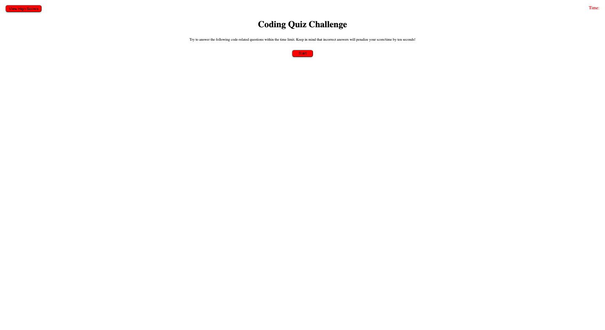

Challenge 4 : Coding Quiz

This week's challenge entails creating a coding quiz. I've created a coding quiz with 5 multiple choice coding related questions. 

- The quiz is timed allowing the user 60 second to successfully answer the quiz, after 60 seconds the user is alerted that their time is up. After question 5 is answered the counter automatically reaches 0. 

- Every wrong answer that the user inputs, results in the user being docked ten seconds on the quiz timer. 

- After the user answers all 5 questions a prompt opens that asks the user to input their initals to add to their score.

- After initials are input, their grade is computed and shown to the user.

- User also has a high score button that records and can show user their score as long as page is not refreshed. 

- User then has the option to press the Take Quiz Again button ans restart the quiz in an attempt to achieve a higher score and that score can also be logged. 

URL : https://gdav24.github.io/CodingQuiz/

Screenshot:

